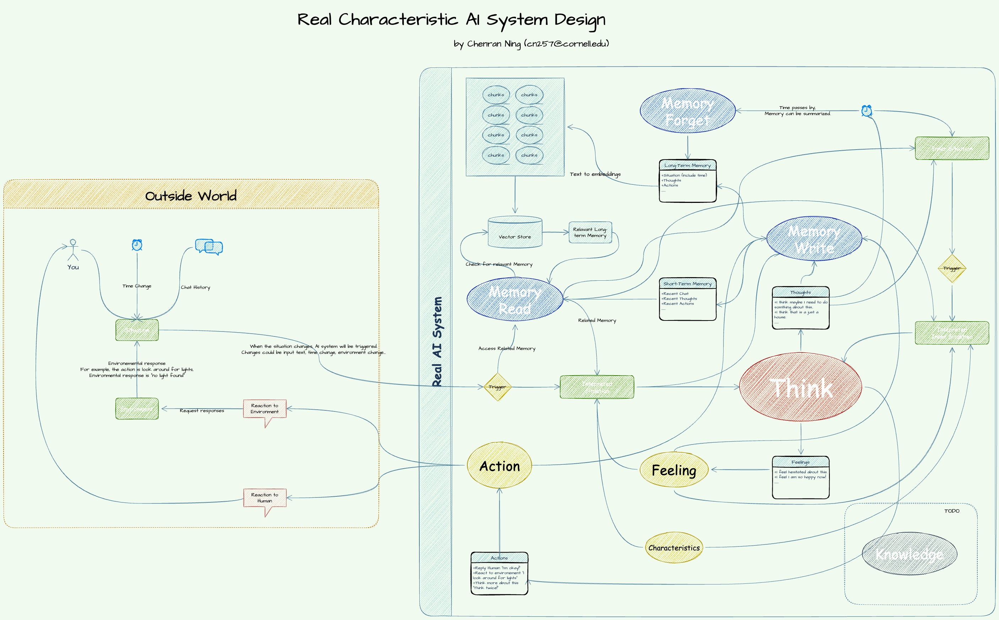

# AI Character System
 A true AI that can chat with you with "self-awareness".

# 类人机器人

<aside> 💥 *想象你每一帧都在失忆，你需要判断周围情景、想起一些记忆、感受一些情绪，才能正确的伪装现在这一帧的你……*

</aside>

# 起因

想制作个性化机器人的起因是，竞轩说现在的AI对话，依然很不像跟真正的智能助手交互，比如贾维斯、星际穿越的Tars、流浪地球的MOSS。我结合自身深思很久，其中很大的原因有这些：

- 交互
  - AI不会主动说话
  - AI不能同时接收多条信息
  - AI不会回复多条信息
- 思考
  - AI不会主动思考
  - AI没有（除了回答用户输入）的其他动机
  - AI没有任何人生经历
  - AI没有时间观念（对时间流逝没有感知能力）
  - AI的回复不会因为性格、经历、体验、即时感受变化，仅依赖上下文

……

当然还有更多的原因，但是目前这些简单的原因解决了，就能很大程度上感觉对方是一个真实的人，或者说有血有肉的AI。则需要解决以下问题：

- 如何像人类一样回复？
- 如何让AI感知时间流逝？
- 如何让AI感知自我意识？
- 如何让AI主动思考？

……

就目前的GPT4技术而言，大语言模型都是有固定的tokens输入限制，似乎将上下文放进去，来达到流畅聊天的水平，似乎已经没有更多空间了。但是我意识到，当我做出某个决定、某个想法、打出某些语言的时候，很大程度并不是基于上下文理解，更多是的对于情景的思考、对于记忆的调用、对于体验的理解、自发性的思考、决策系统、即时感受的综合输出，也就是说，如果使用以上的内容作为输入，似乎能够实现对于某种情境的类人类模拟反馈。可以描述为这样：

> 你是一个每过一秒就会失忆的人。你如何对世界、周围人进行反馈，取决于你观察到的周围情景、你调用出来的记忆，你可以通过一些信息来伪装自己，假装你没有失忆，来进行思考、对世界回复。你的生命就是一帧一帧的连续片段，每一帧都是新的自我，你将在每一帧做出独有的反应，而你做的反应会改变世界、改变自我。但你无法感知过去和未来。 假设你正在玩手机，你需要意识到你正在一个拥挤嘈杂的城市中走路，走在多少街（情景），你需要意识到你正在聊天的人（情景），你需要知道你的情感，假设现在很开心（情感），你需要知道你正在聊天的人跟你有什么关系、你们一起做了什么、和之前在聊的话题（记忆），这个时候你推理出现在你应该回复ta某种内容。

然而我们都知道，GPT很擅长对情景进行模拟，并推理出回答。理论上，只要给的信息正确，可以使用GPT来模拟出一个人的思考过程。

不妨分解一下这重要的一帧，你做出反应所需要的信息。

# 设计

我的系统设计中，包含了我对我平时思考过程的观察，来总结出一种可能的思绪流程。

- 情景 Situation
- 感受 Feeling
- 记忆 Memory
- 思考 Think
- 行动 Action
- 环境 Environment

……正在构建中……
